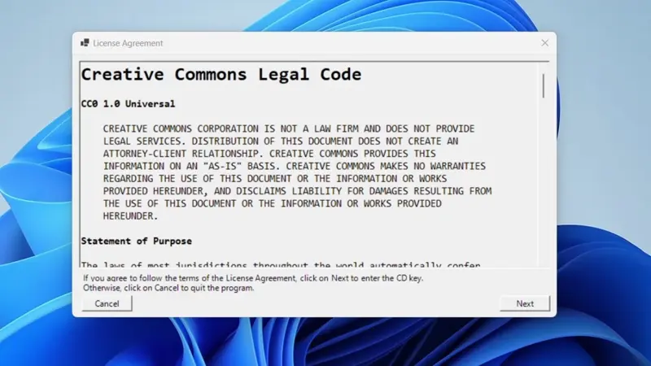

# A3 Wrapper

This project is a *modern remake* of the wrapper technology used within a series of educational, interactive movies produced by Asian American Animation, Ltd from approximately 2008 - 2011. It was written in Visual Studio 2022 with .Net 8 and .Net Standard 2.0, whereas the original solution was developed in Visual Studio 2005 with .Net 2.0.

The program was started [by an autoplay launcher](https://github.com/kernja/vb6-a3-launcher/) and  designed to play embedded Adobe Flash files while protecting them from theft. It incorporated several security features including:

* 3DES encryption
* Registration keys
* Disc checks
* System identification

Adobe Flash is now considered to be a security vulnerability, so the remake encrypts images with captions instead.

## Solution Layout

The solution consists of six projects and employs a multilayer and service-based architecture to enforce separation-of-concerns, although dependency injection and unit tests are not included within the initial release.

* `A3Wrapper.Client`, a program for viewing images that would be deployed to end users (.Net 8)
* `A3Wrapper.AssetPackager`, a program that bundles encrypted photos, captions, and a manifest into a ZIP archive (.Net 8)
* `A3Wrapper.KeyGenerator`, a program that generates program keys (.Net 8)
    * Key `MFXLRNBPIIOAUJLPKKPEQJAYB` can be used with the default key generator settings
* `A3Wrapper.Models`, a class library that contains simple data models (.Net Standard 2.0)
* `A3Wrapper.Services`, a class library that contains services shared between the `Client`, `AssetPackager`, and `KeyGenerator` projects (.Net Standard 2.0)
* `A3Wrapper.SharedResources`, a class library that contains resources shared between all projects (.Net Standard 2.0)

There is also an `Assets` folder that contains files that are already bundled within program resource libraries. The `WRAPR.iso` file is a blank image for passing the program's disc check.

## Configuration

Many configuration values can be configured within the `A3Wrapper.SharedResources` project.
* `A3Strings.resx`, which contains string values for dialog boxes and exceptions
* `A3Resources.resx`, which contains configuration variables such as product name, encryption seeds, and key configuration values.

Resource files *should not* be used for storing sensitive information like encryption keys or other secrets. It was used in this project to minimize the use of [magic numbers](https://en.wikipedia.org/wiki/Magic_number_(programming)).

The `A3Wrapper.AssetPackager` project can also be modified for viewing different photos.
* Add the new photos to the `UnencryptedAssets.resx` file
* Modify metadata entries in the `GenerateAssetMetadata` function in `Program.vb`
* Execute the application to generate a new `encryptedPhotos.zip` file

The updated `encryptedPhotos.zip` file can be inserted in the `ClientResources.resx` file within the `A3Wrapper.Client` project.